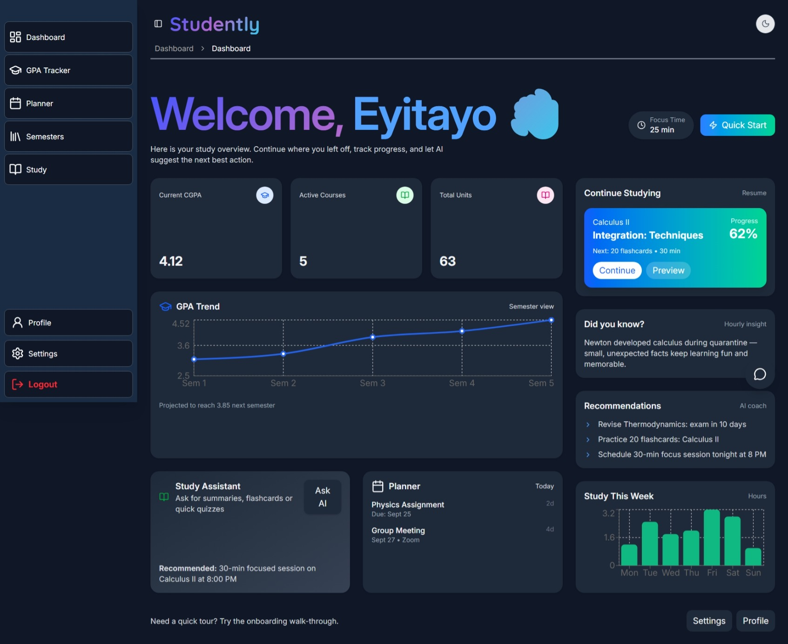
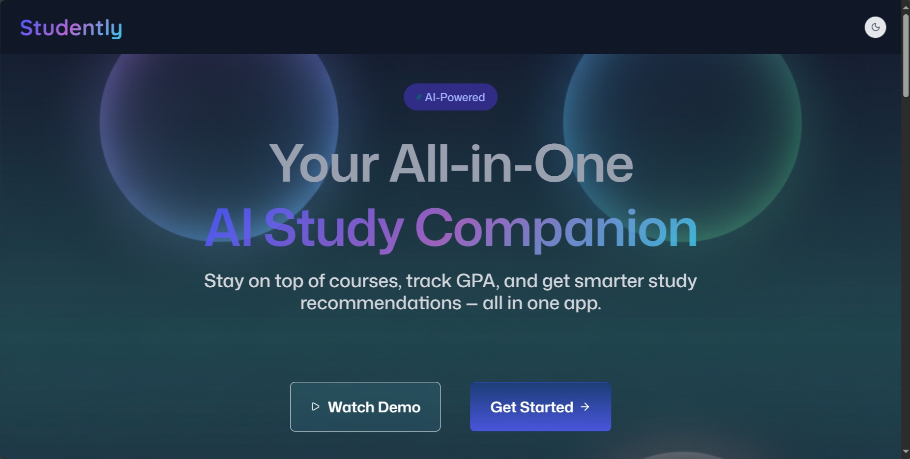

# STUDENTLY


## 📚 Table of Contents
- [Project Overview](#project-overview)
- [Key Features](#key-features)
- [Getting Started](#getting-started)
- [Development](#development)
- [Building for Production](#building-for-production)
- [Deployment](#deployment)
- [Contributing](#contributing)
- [Styling](#styling)
- [Screenshots](#screenshots)
- [License](#license)
- [Live Demo](#-live-demo)
- [Changelog](#-changelog)
## Project overview

Studently unifies course management, assignment tracking, GPA calculation, and AI-assisted study tools (summaries and question generation). It was implemented as a React + TypeScript frontend (React Router v7) and an AWS Amplify backend relying on Lambda functions (business logic) and API Gateway for endpoint exposure. Amazon Bedrock is used for AI summarization and Q&A, S3 is used for storing course resources, DynamoDB for storing metadata, and CloudWatch for monitoring logs.



## Key Features

- User authentication (Amazon Cognito via Amplify)
- Semester / Course management and GPA tracking
- Assignments CRUD and course progress tracking
- Document / notes upload to Amazon S3 (signed uploads handled by backend)
- AI Summarization (calls to Amazon Bedrock from Lambda)
- AI Q&A / Chatbot (Lambda integration) — implemented and tested as a Lambda chatbot function
- Backend logic implemented as AWS Lambda functions invoked through API Gateway (fronted by Amplify configuration)

Note about Amazon Q: The project was directed to include Amazon Q as part of the hackathon brief, but Amazon Q access (QBusiness) requires organizational access.


## Getting Started

### Installation

Install the dependencies:

```bash
npm install
```

### Development

Start the development server with HMR:

```bash
npm run dev
```

Your application will be available at `http://localhost:5173`.

## Building for Production

Create a production build:

```bash
npm run build
```

## Deployment

### Docker Deployment

To build and run using Docker:

```bash
docker build -t my-app .

# Run the container
docker run -p 3000:3000 my-app
```

The containerized application can be deployed to any platform that supports Docker, including:

- AWS ECS
- Google Cloud Run
- Azure Container Apps
- Digital Ocean App Platform
- Fly.io
- Railway


### DIY Deployment

If you're familiar with deploying Node applications, the built-in app server is production-ready.

Make sure to deploy the output of `npm run build`

```
├── package.json
├── package-lock.json (or pnpm-lock.yaml, or bun.lockb)
├── build/
│   ├── client/    # Static assets
│   └── server/    # Server-side code
```




## Contributing
1. Fork the repository.
2. Create a new branch: `git checkout -b feature-name`.
3. Make your changes.
4. Push your branch: `git push origin feature-name`.
5. Create a pull request.


## Styling

This template comes with [Tailwind CSS](https://tailwindcss.com/) already configured for a simple default starting experience. You can use whatever CSS framework you prefer.


## Screenshots

### Landing Page


### Dashboard


## License

This project is licensed under the [MIT License](LICENSE).

## 🚀 Live Demo

[Visit the Live App](https://studently-main.vercel.app)

## 📦 Changelog

- v1.0.0 – Initial hackathon release


---

Built with ❤️ using React Router.
